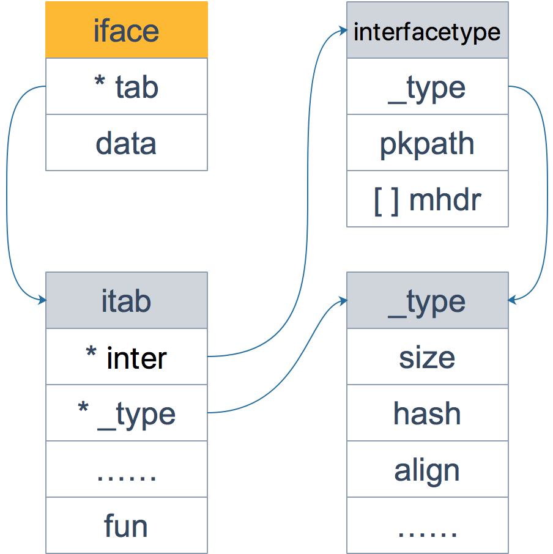

# Go - interface

这次文章依然很长，基本上涵盖了 `interface` 的方方面面，有例子，有源码分析，有汇编分析，前前后后写了 20 多天。洋洋洒洒，长篇大论，依然有些东西没有涉及到，比如文章里没有写到`反射`，当然，后面会单独写一篇关于`反射`的文章，这是后话。

还是希望看你在看完文章后能有所收获，有任何问题或意见建议，欢迎在文章后面留言。

这篇文章的架构比较简单，直接抛出 10 个问题，一一解答。

# 1. Go 语言与鸭子类型的关系

先直接来看维基百科里的定义：

> If it looks like a duck, swims like a duck, and quacks like a duck, then it probably is a duck.

翻译过来就是：如果某个东西长得像鸭子，像鸭子一样游泳，像鸭子一样嘎嘎叫，那它就可以被看成是一只鸭子。

`Duck Typing`，鸭子类型，是动态编程语言的一种对象推断策略，它更关注对象能如何被使用，而不是对象的类型本身。Go 语言作为一门静态语言，它通过通过接口的方式完美支持鸭子类型。

例如，在动态语言 python 中，定义一个这样的函数：

```python
def hello_world(coder):
    coder.say_hello()
```

当调用此函数的时候，可以传入任意类型，只要它实现了 `say_hello()` 函数就可以。如果没有实现，运行过程中会出现错误。

而在静态语言如 Java, C++ 中，必须要显示地声明实现了某个接口，之后，才能用在任何需要这个接口的地方。如果你在程序中调用 `hello_world` 函数，却传入了一个根本就没有实现 `say_hello()` 的类型，那在编译阶段就不会通过。这也是静态语言比动态语言更安全的原因。

动态语言和静态语言的差别在此就有所体现。静态语言在编译期间就能发现类型不匹配的错误，不像动态语言，必须要运行到那一行代码才会报错。插一句，这也是我不喜欢用 `python` 的一个原因。当然，静态语言要求程序员在编码阶段就要按照规定来编写程序，为每个变量规定数据类型，这在某种程度上，加大了工作量，也加长了代码量。动态语言则没有这些要求，可以让人更专注在业务上，代码也更短，写起来更快，这一点，写 python 的同学比较清楚。

Go 语言作为一门现代静态语言，是有后发优势的。它引入了动态语言的便利，同时又会进行静态语言的类型检查，写起来是非常 Happy 的。Go 采用了折中的做法：不要求类型显示地声明实现了某个接口，只要实现了相关的方法即可，编译器就能检测到。

来看个例子：

先定义一个接口，和使用此接口作为参数的函数：

```go
type IGreeting interface {
	sayHello()
}

func sayHello(i IGreeting) {
	i.sayHello()
}
```

再来定义两个结构体：

```go
type Go struct {}
func (g Go) sayHello() {
	fmt.Println("Hi, I am GO!")
}

type PHP struct {}
func (p PHP) sayHello() {
	fmt.Println("Hi, I am PHP!")
}
```

最后，在 main 函数里调用 sayHello() 函数：

```go
func main() {
	golang := Go{}
	php := PHP{}

	sayHello(golang)
	sayHello(php)
}
```

程序输出：

```
Hi, I am GO!
Hi, I am PHP!
```

在 main 函数中，调用调用 sayHello() 函数时，传入了 `golang, php` 对象，它们并没有显式地声明实现了 IGreeting 类型，只是实现了接口所规定的 sayHello() 函数。实际上，编译器在调用 sayHello() 函数时，会隐式地将 `golang, php` 对象转换成 IGreeting 类型，这也是静态语言的类型检查功能。

顺带再提一下动态语言的特点：

> 变量绑定的类型是不确定的，在运行期间才能确定
> 函数和方法可以接收任何类型的参数，且调用时不检查参数类型
> 不需要实现接口

总结一下，鸭子类型是一种动态语言的风格，在这种风格中，一个对象有效的语义，不是由继承自特定的类或实现特定的接口，而是由它”当前方法和属性的集合”决定。Go 作为一种静态语言，通过接口实现了 `鸭子类型`，实际上是 Go 的编译器在其中作了隐匿的转换工作。

# 2. 值接收者和指针接收者的区别

## 方法

方法能给用户自定义的类型添加新的行为。它和函数的区别在于方法有一个接收者，给一个函数添加一个接收者，那么它就变成了方法。接收者可以是`值接收者`，也可以是`指针接收者`。

在调用方法的时候，值类型既可以调用`值接收者`的方法，也可以调用`指针接收者`的方法；指针类型既可以调用`指针接收者`的方法，也可以调用`值接收者`的方法。

也就是说，不管方法的接收者是什么类型，该类型的值和指针都可以调用，不必严格符合接收者的类型。

来看个例子：

```go
package main

import "fmt"

type Person struct {
	age int
}

func (p Person) howOld() int {
	return p.age
}

func (p *Person) growUp() {
	p.age += 1
}

func main() {
	// qcrao 是值类型
	qcrao := Person{age: 18}

	// 值类型 调用接收者也是值类型的方法
	fmt.Println(qcrao.howOld())

	// 值类型 调用接收者是指针类型的方法
	qcrao.growUp()
	fmt.Println(qcrao.howOld())

	// ----------------------

	// stefno 是指针类型
	stefno := &Person{age: 100}

	// 指针类型 调用接收者是值类型的方法
	fmt.Println(stefno.howOld())

	// 指针类型 调用接收者也是指针类型的方法
	stefno.growUp()
	fmt.Println(stefno.howOld())
}
```

上例子的输出结果是：

```
18
19
100
101
```

调用了 `growUp` 函数后，不管调用者是值类型还是指针类型，它的 `Age` 值都改变了。

实际上，当类型和方法的接收者类型不同时，其实是编译器在背后做了一些工作，用一个表格来呈现：

| -              | 值接收者                                                     | 指针接收者                                                   |
| -------------- | ------------------------------------------------------------ | ------------------------------------------------------------ |
| 值类型调用者   | 方法会使用调用者的一个副本，类似于“传值”                     | 使用值的引用来调用方法，上例中，`qcrao.growUp()` 实际上是 `(&qcrao).growUp()` |
| 指针类型调用者 | 指针被解引用为值，上例中，`stefno.howOld()` 实际上是 `(*stefno).howOld()` | 实际上也是“传值”，方法里的操作会影响到调用者，类似于指针传参，拷贝了一份指针 |

## 值接收者和指针接收者

前面说过，不管接收者类型是值类型还是指针类型，都可以通过值类型或指针类型调用，这里面实际上通过语法糖起作用的。

先说结论：实现了接收者是值类型的方法，相当于自动实现了接收者是指针类型的方法；而实现了接收者是指针类型的方法，不会自动生成对应接收者是值类型的方法。

来看一个例子，就会完全明白：

```go
package main

import "fmt"

type coder interface {
	code()
	debug()
}

type Gopher struct {
	language string
}

func (p Gopher) code() {
	fmt.Printf("I am coding %s language\n", p.language)
}

func (p *Gopher) debug() {
	fmt.Printf("I am debuging %s language\n", p.language)
}

func main() {
	var c coder = &Gopher{"Go"}
	c.code()
	c.debug()
}
```

上述代码里定义了一个接口 `coder`，接口定义了两个函数：

```
code()
debug()
```

接着定义了一个结构体 `Gopher`，它实现了两个方法，一个值接收者，一个指针接收者。

最后，我们在 `main` 函数里通过接口类型的变量调用了定义的两个函数。

运行一下，结果：

```
I am coding Go language
I am debuging Go language
```

但是如果我们把 `main` 函数的第一条语句换一下：

```go
func main() {
	var c coder = Gopher{"Go"}
	c.code()
	c.debug()
}
```

运行一下，报错：

```
./main.go:23:6: cannot use Gopher literal (type Gopher) as type coder in assignment:
	Gopher does not implement coder (debug method has pointer receiver)
```

看出这两处代码的差别了吗？第一次是将 `&Gopher` 赋给了 `coder`；第二次则是将 `Gopher` 赋给了 `coder`。

第二次报错是说，`Gopher` 没有实现 `coder`，很明显了吧？因为 `Gopher` 类型并没有实现 `debug` 方法。表面上看， `*Gopher` 类型也没有实现 `code` 方法，但是因为 `Gopher` 类型实现了 `code` 方法，所以让 `*Gopher` 类型自动拥有了 `code` 方法。

当然，上面的说法有一个简单的解释：接收者是指针类型的方法，很可能在方法中会对接收者的属性进行更改操作，从而影响接收者；而对于接收者是值类型的方法，在方法中不会对接收者本身产生影响。

所以，当实现了一个接收者是值类型的方法，就可以自动生成一个接收者是对应指针类型的方法，因为两者都不会影响接收者。但是，当实现了一个接收者是指针类型的方法，如果此时自动生成一个接收者是值类型的方法，原本期望对接收者的改变（通过指针实现），现在无法实现，因为值类型会产生一个拷贝，不会真正影响调用者。

最后，只要记住下面这点就可以了：

> 如果实现了接收者是值类型的方法，会隐含地也实现了接收者是指针类型的方法。

## 两者分别在何时使用

如果方法的接收者是值类型，无论调用者是对象还是对象指针，修改的都是对象的副本，不影响调用者；如果方法的接收者是指针类型，则调用者修改的是指针指向的对象本身。

使用指针作为方法的接收者的理由：

- 方法能够修改接收者指向的值。
- 避免在每次调用方法时复制该值，在值的类型为大型结构体时，这样做会更加高效。

是使用值接收者还是指针接收者，不是由该方法是否修改了调用者（也就是接收者）来决定，而是应该基于该类型的`本质`。

如果类型具备“原始的本质”，也就是说它的成员都是由 Go 语言里内置的原始类型，如字符串，整型值等，那就定义值接收者类型的方法。像内置的引用类型，如 slice，map，interface，channel，这些类型比较特殊，声明他们的时候，实际上是创建了一个 `header`， 对于他们也是直接定义值接收者类型的方法。这样，调用函数时，是直接 copy 了这些类型的 `header`，而 `header` 本身就是为复制设计的。

如果类型具备非原始的本质，不能被安全地复制，这种类型总是应该被共享，那就定义指针接收者的方法。比如 go 源码里的文件结构体（struct File）就不应该被复制，应该只有一份`实体`。

这一段说的比较绕，大家可以去看《Go 语言实战》5.3 那一节。

# 3. iface 和 eface 的区别是什么

`iface` 和 `eface` 都是 Go 中描述接口的底层结构体，区别在于 `iface` 描述的接口包含方法，而 `eface` 则是不包含任何方法的空接口：`interface{}`。

从源码层面看一下：

```go
type iface struct {
	tab  *itab
	data unsafe.Pointer
}

type itab struct {
	inter  *interfacetype
	_type  *_type
	link   *itab
	hash   uint32 // copy of _type.hash. Used for type switches.
	bad    bool   // type does not implement interface
	inhash bool   // has this itab been added to hash?
	unused [2]byte
	fun    [1]uintptr // variable sized
}
```

`iface` 内部维护两个指针，`tab` 指向一个 `itab` 实体， 它表示接口的类型以及赋给这个接口的实体类型。`data` 则指向接口具体的值，一般而言是一个指向堆内存的指针。

再来仔细看一下 `itab` 结构体：`_type` 字段描述了实体的类型，包括内存对齐方式，大小等；`inter` 字段则描述了接口的类型。`fun` 字段放置和接口方法对应的具体数据类型的方法地址，实现接口调用方法的动态分派，一般在每次给接口赋值发生转换时会更新此表，或者直接拿缓存的 itab。

这里只会列出实体类型和接口相关的方法，实体类型的其他方法并不会出现在这里。如果你学过 C++ 的话，这里可以类比虚函数的概念。

另外，你可能会觉得奇怪，为什么 `fun` 数组的大小为 1，要是接口定义了多个方法可怎么办？实际上，这里存储的是第一个方法的函数指针，如果有更多的方法，在它之后的内存空间里继续存储。从汇编角度来看，通过增加地址就能获取到这些函数指针，没什么影响。顺便提一句，这些方法是按照函数名称的字典序进行排列的。

再看一下 `interfacetype` 类型，它描述的是接口的类型：

```go
type interfacetype struct {
	typ     _type
	pkgpath name
	mhdr    []imethod
}
```

可以看到，它包装了 `_type` 类型，`_type` 实际上是描述 Go 语言中各种数据类型的结构体。我们注意到，这里还包含一个 `mhdr` 字段，表示接口所定义的函数列表， `pkgpath` 记录定义了接口的包名。

这里通过一张图来看下 `iface` 结构体的全貌：



iface 结构体全景

接着来看一下 `eface` 的源码：

```
type eface struct {
    _type *_type
    data  unsafe.Pointer
}
```

相比 `iface`，`eface` 就比较简单了。只维护了一个 `_type` 字段，表示空接口所承载的具体的实体类型。`data` 描述了具体的值。


eface 结构体全景

我们来看个例子：

```go
package main

import "fmt"

func main() {
	x := 200
	var any interface{} = x
	fmt.Println(any)

	g := Gopher{"Go"}
	var c coder = g
	fmt.Println(c)
}

type coder interface {
	code()
	debug()
}

type Gopher struct {
	language string
}

func (p Gopher) code() {
	fmt.Printf("I am coding %s language\n", p.language)
}

func (p Gopher) debug() {
	fmt.Printf("I am debuging %s language\n", p.language)
}
```

执行命令，打印出汇编语言：

```
go tool compile -S ./src/main.go
```

可以看到，main 函数里调用了两个函数：

```go
func convT2E64(t *_type, elem unsafe.Pointer) (e eface)
func convT2I(tab *itab, elem unsafe.Pointer) (i iface)
```

上面两个函数的参数和 `iface` 及 `eface` 结构体的字段是可以联系起来的：两个函数都是将参数`组装`一下，形成最终的接口。

作为补充，我们最后再来看下 `_type` 结构体：

```go
type _type struct {
    // 类型大小
	size       uintptr
    ptrdata    uintptr
    // 类型的 hash 值
    hash       uint32
    // 类型的 flag，和反射相关
    tflag      tflag
    // 内存对齐相关
    align      uint8
    fieldalign uint8
    // 类型的编号，有bool, slice, struct 等等等等
	kind       uint8
	alg        *typeAlg
	// gc 相关
	gcdata    *byte
	str       nameOff
	ptrToThis typeOff
}
```

Go 语言各种数据类型都是在 `_type` 字段的基础上，增加一些额外的字段来进行管理的：

```go
type arraytype struct {
	typ   _type
	elem  *_type
	slice *_type
	len   uintptr
}

type chantype struct {
	typ  _type
	elem *_type
	dir  uintptr
}

type slicetype struct {
	typ  _type
	elem *_type
}

type structtype struct {
	typ     _type
	pkgPath name
	fields  []structfield
}
```

这些数据类型的结构体定义，是反射实现的基础。

# 4. 接口的动态类型和动态值

从源码里可以看到：`iface`包含两个字段：`tab` 是接口表指针，指向类型信息；`data` 是数据指针，则指向具体的数据。它们分别被称为`动态类型`和`动态值`。而接口值包括`动态类型`和`动态值`。

【引申1】接口类型和 `nil` 作比较

接口值的零值是指`动态类型`和`动态值`都为 `nil`。当仅且当这两部分的值都为 `nil` 的情况下，这个接口值就才会被认为 `接口值 == nil`。

来看个例子：

```go
package main

import "fmt"

type Coder interface {
	code()
}

type Gopher struct {
	name string
}

func (g Gopher) code() {
	fmt.Printf("%s is coding\n", g.name)
}

func main() {
	var c Coder
	fmt.Println(c == nil)
	fmt.Printf("c: %T, %v\n", c, c)

	var g *Gopher
	fmt.Println(g == nil)

	c = g
	fmt.Println(c == nil)
	fmt.Printf("c: %T, %v\n", c, c)
}
```

输出：

```
true
c: <nil>, <nil>
true
false
c: *main.Gopher, <nil>
```

一开始，`c` 的 动态类型和动态值都为 `nil`，`g` 也为 `nil`，当把 `g` 赋值给 `c` 后，`c` 的动态类型变成了 `*main.Gopher`，仅管 `c` 的动态值仍为 `nil`，但是当 `c` 和 `nil` 作比较的时候，结果就是 `false` 了。

【引申2】
来看一个例子，看一下它的输出：

```go
package main

import "fmt"

type MyError struct {}

func (i MyError) Error() string {
	return "MyError"
}

func main() {
	err := Process()
	fmt.Println(err)

	fmt.Println(err == nil)
}

func Process() error {
	var err *MyError = nil
	return err
}
```

函数运行结果：

```
<nil>
false
```

这里先定义了一个 `MyError` 结构体，实现了 `Error` 函数，也就实现了 `error` 接口。`Process` 函数返回了一个 `error` 接口，这块隐含了类型转换。所以，虽然它的值是 `nil`，其实它的类型是 `*MyError`，最后和 `nil` 比较的时候，结果为 `false`。

【引申3】如何打印出接口的动态类型和值？

直接看代码：

```go
package main

import (
	"unsafe"
	"fmt"
)

type iface struct {
	itab, data uintptr
}

func main() {
	var a interface{} = nil

	var b interface{} = (*int)(nil)

	x := 5
	var c interface{} = (*int)(&x)
	
	ia := *(*iface)(unsafe.Pointer(&a))
	ib := *(*iface)(unsafe.Pointer(&b))
	ic := *(*iface)(unsafe.Pointer(&c))

	fmt.Println(ia, ib, ic)

	fmt.Println(*(*int)(unsafe.Pointer(ic.data)))
}
```

代码里直接定义了一个 `iface` 结构体，用两个指针来描述 `itab` 和 `data`，之后将 a, b, c 在内存中的内容强制解释成我们自定义的 `iface`。最后就可以打印出动态类型和动态值的地址。

运行结果如下：

```
{0 0} {17426912 0} {17426912 842350714568}
5
```

a 的动态类型和动态值的地址均为 0，也就是 nil；b 的动态类型和 c 的动态类型一致，都是 `*int`；最后，c 的动态值为 5。

# 5. 编译器自动检测类型是否实现接口

经常看到一些开源库里会有一些类似下面这种奇怪的用法：

```go
var _ io.Writer = (*myWriter)(nil)
```

这时候会有点懵，不知道作者想要干什么，实际上这就是此问题的答案。编译器会由此检查 `*myWriter` 类型是否实现了 `io.Writer` 接口。

来看一个例子：

```go
package main

import "io"

type myWriter struct {

}

/*func (w myWriter) Write(p []byte) (n int, err error) {
	return
}*/

func main() {
    // 检查 *myWriter 类型是否实现了 io.Writer 接口
    var _ io.Writer = (*myWriter)(nil)

    // 检查 myWriter 类型是否实现了 io.Writer 接口
    var _ io.Writer = myWriter{}
}
```

注释掉为 myWriter 定义的 Write 函数后，运行程序：

```
src/main.go:14:6: cannot use (*myWriter)(nil) (type *myWriter) as type io.Writer in assignment:
	*myWriter does not implement io.Writer (missing Write method)
src/main.go:15:6: cannot use myWriter literal (type myWriter) as type io.Writer in assignment:
	myWriter does not implement io.Writer (missing Write method)
```

报错信息：*myWriter/myWriter 未实现 io.Writer 接口，也就是未实现 Write 方法。

解除注释后，运行程序不报错。

实际上，上述赋值语句会发生隐式地类型转换，在转换的过程中，编译器会检测等号右边的类型是否实现了等号左边接口所规定的函数。

总结一下，可通过在代码中添加类似如下的代码，用来检测类型是否实现了接口：

```go
var _ io.Writer = (*myWriter)(nil)
var _ io.Writer = myWriter{}
```

# 6. 接口的构造过程是怎样的

我们已经看过了 `iface` 和 `eface` 的源码，知道 `iface` 最重要的是 `itab` 和 `_type`。

为了研究清楚接口是如何构造的，接下来我会拿起汇编的武器，还原背后的真相。

来看一个示例代码：

```go
package main

import "fmt"

type Person interface {
	growUp()
}

type Student struct {
	age int
}

func (p Student) growUp() {
	p.age += 1
	return
}

func main() {
	var qcrao = Person(Student{age: 18})

	fmt.Println(qcrao)
}
```

执行命令：

```bash
go tool compile -S main.go
```

得到 main 函数的汇编代码如下：

```
0x0000 00000 (./src/main.go:30) TEXT    "".main(SB), $80-0
0x0000 00000 (./src/main.go:30) MOVQ    (TLS), CX
0x0009 00009 (./src/main.go:30) CMPQ    SP, 16(CX)
0x000d 00013 (./src/main.go:30) JLS     157
0x0013 00019 (./src/main.go:30) SUBQ    $80, SP
0x0017 00023 (./src/main.go:30) MOVQ    BP, 72(SP)
0x001c 00028 (./src/main.go:30) LEAQ    72(SP), BP
0x0021 00033 (./src/main.go:30) FUNCDATA$0, gclocals·69c1753bd5f81501d95132d08af04464(SB)
0x0021 00033 (./src/main.go:30) FUNCDATA$1, gclocals·e226d4ae4a7cad8835311c6a4683c14f(SB)
0x0021 00033 (./src/main.go:31) MOVQ    $18, ""..autotmp_1+48(SP)
0x002a 00042 (./src/main.go:31) LEAQ    go.itab."".Student,"".Person(SB), AX
0x0031 00049 (./src/main.go:31) MOVQ    AX, (SP)
0x0035 00053 (./src/main.go:31) LEAQ    ""..autotmp_1+48(SP), AX
0x003a 00058 (./src/main.go:31) MOVQ    AX, 8(SP)
0x003f 00063 (./src/main.go:31) PCDATA  $0, $0
0x003f 00063 (./src/main.go:31) CALL    runtime.convT2I64(SB)
0x0044 00068 (./src/main.go:31) MOVQ    24(SP), AX
0x0049 00073 (./src/main.go:31) MOVQ    16(SP), CX
0x004e 00078 (./src/main.go:33) TESTQ   CX, CX
0x0051 00081 (./src/main.go:33) JEQ     87
0x0053 00083 (./src/main.go:33) MOVQ    8(CX), CX
0x0057 00087 (./src/main.go:33) MOVQ    $0, ""..autotmp_2+56(SP)
0x0060 00096 (./src/main.go:33) MOVQ    $0, ""..autotmp_2+64(SP)
0x0069 00105 (./src/main.go:33) MOVQ    CX, ""..autotmp_2+56(SP)
0x006e 00110 (./src/main.go:33) MOVQ    AX, ""..autotmp_2+64(SP)
0x0073 00115 (./src/main.go:33) LEAQ    ""..autotmp_2+56(SP), AX
0x0078 00120 (./src/main.go:33) MOVQ    AX, (SP)
0x007c 00124 (./src/main.go:33) MOVQ    $1, 8(SP)
0x0085 00133 (./src/main.go:33) MOVQ    $1, 16(SP)
0x008e 00142 (./src/main.go:33) PCDATA  $0, $1
0x008e 00142 (./src/main.go:33) CALL    fmt.Println(SB)
0x0093 00147 (./src/main.go:34) MOVQ    72(SP), BP
0x0098 00152 (./src/main.go:34) ADDQ    $80, SP
0x009c 00156 (./src/main.go:34) RET
0x009d 00157 (./src/main.go:34) NOP
0x009d 00157 (./src/main.go:30) PCDATA  $0, $-1
0x009d 00157 (./src/main.go:30) CALL    runtime.morestack_noctxt(SB)
0x00a2 00162 (./src/main.go:30) JMP     0
```

我们从第 10 行开始看，如果不理解前面几行汇编代码的话，可以回去看看公众号前面两篇文章，这里我就省略了。

| 汇编行数 | 操作                                    |
| -------- | --------------------------------------- |
| 10-14    | 构造调用 `runtime.convT2I64(SB)` 的参数 |

我们来看下这个函数的参数形式：

```go
func convT2I64(tab *itab, elem unsafe.Pointer) (i iface) {
	// ……
}
```

`convT2I64` 会构造出一个 `inteface`，也就是我们的 `Person` 接口。

第一个参数的位置是 `(SP)`，这里被赋上了 `go.itab."".Student,"".Person(SB)` 的地址。

我们从生成的汇编找到：

```
go.itab."".Student,"".Person SNOPTRDATA dupok size=40
        0x0000 00 00 00 00 00 00 00 00 00 00 00 00 00 00 00 00  
        0x0010 00 00 00 00 00 00 00 00 da 9f 20 d4              
        rel 0+8 t=1 type."".Person+0
        rel 8+8 t=1 type."".Student+0
```

`size=40` 大小为40字节，回顾一下：

```go
type itab struct {
	inter  *interfacetype // 8字节
	_type  *_type // 8字节
	link   *itab // 8字节
	hash   uint32 // 4字节
	bad    bool   // 1字节
	inhash bool   // 1字节
	unused [2]byte // 2字节
	fun    [1]uintptr // variable sized // 8字节
}
```

把每个字段的大小相加，`itab` 结构体的大小就是 40 字节。上面那一串数字实际上是 `itab` 序列化后的内容，注意到大部分数字是 0，从 24 字节开始的 4 个字节 `da 9f 20 d4` 实际上是 `itab` 的 `hash` 值，这在判断两个类型是否相同的时候会用到。

下面两行是链接指令，简单说就是将所有源文件综合起来，给每个符号赋予一个全局的位置值。这里的意思也比较明确：前8个字节最终存储的是 `type."".Person` 的地址，对应 `itab` 里的 `inter` 字段，表示接口类型；8-16 字节最终存储的是 `type."".Student` 的地址，对应 `itab` 里 `_type` 字段，表示具体类型。

第二个参数就比较简单了，它就是数字 `18` 的地址，这也是初始化 `Student` 结构体的时候会用到。

| 汇编行数 | 操作                         |
| -------- | ---------------------------- |
| 15       | 调用 `runtime.convT2I64(SB)` |

具体看下代码：

```go
func convT2I64(tab *itab, elem unsafe.Pointer) (i iface) {
	t := tab._type
	
	//...
	
	var x unsafe.Pointer
	if *(*uint64)(elem) == 0 {
		x = unsafe.Pointer(&zeroVal[0])
	} else {
		x = mallocgc(8, t, false)
		*(*uint64)(x) = *(*uint64)(elem)
	}
	i.tab = tab
	i.data = x
	return
}
```

这块代码比较简单，把 `tab` 赋给了 `iface` 的 `tab` 字段；`data` 部分则是在堆上申请了一块内存，然后将 `elem` 指向的 `18` 拷贝过去。这样 `iface` 就组装好了。

| 汇编行数 | 操作                                                         |
| -------- | ------------------------------------------------------------ |
| 17       | 把 `i.tab` 赋给 `CX`                                         |
| 18       | 把 `i.data` 赋给 `AX`                                        |
| 19-21    | 检测 `i.tab` 是否是 nil，如果不是的话，把 CX 移动 8 个字节，也就是把 `itab` 的 `_type` 字段赋给了 CX，这也是接口的实体类型，最终要作为 `fmt.Println` 函数的参数 |

后面，就是调用 `fmt.Println` 函数及之前的参数准备工作了，不再赘述。

这样，我们就把一个 `interface` 的构造过程说完了。

【引申1】
如何打印出接口类型的 `Hash` 值？

这里参考曹大神翻译的一篇文章，参考资料里会写上。具体做法如下：

```go
type iface struct {
	tab  *itab
	data unsafe.Pointer
}
type itab struct {
	inter uintptr
	_type uintptr
	link uintptr
	hash  uint32
	_     [4]byte
	fun   [1]uintptr
}

func main() {
	var qcrao = Person(Student{age: 18})

	iface := (*iface)(unsafe.Pointer(&qcrao))
	fmt.Printf("iface.tab.hash = %#x\n", iface.tab.hash)
}
```

定义了一个`山寨版`的 `iface` 和 `itab`，说它`山寨`是因为 `itab` 里的一些关键数据结构都不具体展开了，比如 `_type`，对比一下正宗的定义就可以发现，但是`山寨版`依然能工作，因为 `_type` 就是一个指针而已嘛。

在 `main` 函数里，先构造出一个接口对象 `qcrao`，然后强制类型转换，最后读取出 `hash` 值，非常妙！你也可以自己动手试一下。

运行结果：

```
iface.tab.hash = 0xd4209fda
```

值得一提的是，构造接口 `qcrao` 的时候，即使我把 `age` 写成其他值，得到的 `hash` 值依然不变的，这应该是可以预料的，`hash` 值只和他的字段、方法相关。

# 7. 类型转换和断言的区别

我们知道，Go 语言中不允许隐式类型转换，也就是说 `=` 两边，不允许出现类型不相同的变量。

`类型转换`、`类型断言`本质都是把一个类型转换成另外一个类型。不同之处在于，类型断言是对接口变量进行的操作。

## 类型转换

对于`类型转换`而言，转换前后的两个类型要相互兼容才行。类型转换的语法为：

> <结果类型> := <目标类型> ( <表达式> )

```go
package main

import "fmt"

func main() {
	var i int = 9

	var f float64
	f = float64(i)
	fmt.Printf("%T, %v\n", f, f)

	f = 10.8
	a := int(f)
	fmt.Printf("%T, %v\n", a, a)

	// s := []int(i)
}
```

上面的代码里，我定义了一个 `int` 型和 `float64` 型的变量，尝试在它们之前相互转换，结果是成功的：`int` 型和 `float64` 是相互兼容的。

如果我把最后一行代码的注释去掉，编译器会报告类型不兼容的错误：

```
cannot convert i (type int) to type []int
```

## 断言

前面说过，因为空接口 `interface{}` 没有定义任何函数，因此 Go 中所有类型都实现了空接口。当一个函数的形参是 `interface{}`，那么在函数中，需要对形参进行断言，从而得到它的真实类型。

断言的语法为：

> <目标类型的值>，<布尔参数> := <表达式>.( 目标类型 ) // 安全类型断言
> <目标类型的值> := <表达式>.( 目标类型 )　　//非安全类型断言

类型转换和类型断言有些相似，不同之处，在于类型断言是对接口进行的操作。

还是来看一个简短的例子：

```go
package main

import "fmt"

type Student struct {
	Name string
	Age int
}

func main() {
	var i interface{} = new(Student)
	s := i.(Student)
	
	fmt.Println(s)
}
```

运行一下：

```
panic: interface conversion: interface {} is *main.Student, not main.Student
```

直接 `panic` 了，这是因为 `i` 是 `*Student` 类型，并非 `Student` 类型，断言失败。这里直接发生了 `panic`，线上代码可能并不适合这样做，可以采用“安全断言”的语法：

```go
func main() {
	var i interface{} = new(Student)
	s, ok := i.(Student)
	if ok {
		fmt.Println(s)
	}
}
```

这样，即使断言失败也不会 `panic`。

断言其实还有另一种形式，就是用在利用 `switch` 语句判断接口的类型。每一个 `case` 会被顺序地考虑。当命中一个 `case` 时，就会执行 `case` 中的语句，因此 `case` 语句的顺序是很重要的，因为很有可能会有多个 `case` 匹配的情况。

代码示例如下：

```go
func main() {
	//var i interface{} = new(Student)
	//var i interface{} = (*Student)(nil)
	var i interface{}

	fmt.Printf("%p %v\n", &i, i)

	judge(i)
}

func judge(v interface{}) {
	fmt.Printf("%p %v\n", &v, v)

	switch v := v.(type) {
	case nil:
		fmt.Printf("%p %v\n", &v, v)
		fmt.Printf("nil type[%T] %v\n", v, v)

	case Student:
		fmt.Printf("%p %v\n", &v, v)
		fmt.Printf("Student type[%T] %v\n", v, v)

	case *Student:
		fmt.Printf("%p %v\n", &v, v)
		fmt.Printf("*Student type[%T] %v\n", v, v)

	default:
		fmt.Printf("%p %v\n", &v, v)
		fmt.Printf("unknow\n")
	}
}

type Student struct {
	Name string
	Age int
}
```

`main` 函数里有三行不同的声明，每次运行一行，注释另外两行，得到三组运行结果：

```
// --- var i interface{} = new(Student)
0xc4200701b0 [Name: ], [Age: 0]
0xc4200701d0 [Name: ], [Age: 0]
0xc420080020 [Name: ], [Age: 0]
*Student type[*main.Student] [Name: ], [Age: 0]

// --- var i interface{} = (*Student)(nil)
0xc42000e1d0 <nil>
0xc42000e1f0 <nil>
0xc42000c030 <nil>
*Student type[*main.Student] <nil>

// --- var i interface{}
0xc42000e1d0 <nil>
0xc42000e1e0 <nil>
0xc42000e1f0 <nil>
nil type[<nil>] <nil>
```

对于第一行语句：

```go
var i interface{} = new(Student)
```

`i` 是一个 `*Student` 类型，匹配上第三个 case，从打印的三个地址来看，这三处的变量实际上都是不一样的。在 `main` 函数里有一个局部变量 `i`；调用函数时，实际上是复制了一份参数，因此函数里又有一个变量 `v`，它是 `i` 的拷贝；断言之后，又生成了一份新的拷贝。所以最终打印的三个变量的地址都不一样。

对于第二行语句：

```go
var i interface{} = (*Student)(nil)
```

这里想说明的其实是 `i` 在这里动态类型是 `(*Student)`, 数据为 `nil`，它的类型并不是 `nil`，它与 `nil` 作比较的时候，得到的结果也是 `false`。

最后一行语句：

```go
var i interface{}
```

这回 `i` 才是 `nil` 类型。

【引申1】
`fmt.Println` 函数的参数是 `interface`。对于内置类型，函数内部会用穷举法，得出它的真实类型，然后转换为字符串打印。而对于自定义类型，首先确定该类型是否实现了 `String()` 方法，如果实现了，则直接打印输出 `String()` 方法的结果；否则，会通过反射来遍历对象的成员进行打印。

再来看一个简短的例子，比较简单，不要紧张：

```go
package main

import "fmt"

type Student struct {
	Name string
	Age int
}

func main() {
	var s = Student{
		Name: "qcrao",
		Age: 18,
	}

	fmt.Println(s)
}
```

因为 `Student` 结构体没有实现 `String()` 方法，所以 `fmt.Println` 会利用反射挨个打印成员变量：

```
{qcrao 18}
```

增加一个 `String()` 方法的实现：

```go
func (s Student) String() string {
	return fmt.Sprintf("[Name: %s], [Age: %d]", s.Name, s.Age)
}
```

打印结果：

```
[Name: qcrao], [Age: 18]
```

按照我们自定义的方法来打印了。

【引申2】
针对上面的例子，如果改一下：

```go
func (s *Student) String() string {
	return fmt.Sprintf("[Name: %s], [Age: %d]", s.Name, s.Age)
}
```

注意看两个函数的接受者类型不同，现在 `Student` 结构体只有一个接受者类型为 `指针类型` 的 `String()` 函数，打印结果：

```
{qcrao 18}
```

为什么？

> 类型 `T` 只有接受者是 `T` 的方法；而类型 `*T` 拥有接受者是 `T` 和 `*T` 的方法。语法上 `T` 能直接调 `*T` 的方法仅仅是 `Go` 的语法糖。

所以， `Student` 结构体定义了接受者类型是值类型的 `String()` 方法时，通过

```go
fmt.Println(s)
fmt.Println(&s)
```

均可以按照自定义的格式来打印。

如果 `Student` 结构体定义了接受者类型是指针类型的 `String()` 方法时，只有通过

```go
fmt.Println(&s)
```

才能按照自定义的格式打印。

# 8. 接口转换的原理

通过前面提到的 `iface` 的源码可以看到，实际上它包含接口的类型 `interfacetype` 和 实体类型的类型 `_type`，这两者都是 `iface` 的字段 `itab` 的成员。也就是说生成一个 `itab` 同时需要接口的类型和实体的类型。

> <interface 类型， 实体类型> ->itable

当判定一种类型是否满足某个接口时，Go 使用类型的方法集和接口所需要的方法集进行匹配，如果类型的方法集完全包含接口的方法集，则可认为该类型实现了该接口。

例如某类型有 `m` 个方法，某接口有 `n` 个方法，则很容易知道这种判定的时间复杂度为 `O(mn)`，Go 会对方法集的函数按照函数名的字典序进行排序，所以实际的时间复杂度为 `O(m+n)`。

这里我们来探索将一个接口转换给另外一个接口背后的原理，当然，能转换的原因必然是类型兼容。

直接来看一个例子：

```go
package main

import "fmt"

type coder interface {
	code()
	run()
}

type runner interface {
	run()
}

type Gopher struct {
	language string
}

func (g Gopher) code() {
	return
}

func (g Gopher) run() {
	return
}

func main() {
	var c coder = Gopher{}

	var r runner
	r = c
	fmt.Println(c, r)
}
```

简单解释下上述代码：定义了两个 `interface`: `coder` 和 `runner`。定义了一个实体类型 `Gopher`，类型 `Gopher` 实现了两个方法，分别是 `run()` 和 `code()`。main 函数里定义了一个接口变量 `c`，绑定了一个 `Gopher` 对象，之后将 `c` 赋值给另外一个接口变量 `r` 。赋值成功的原因是 `c` 中包含 `run()` 方法。这样，两个接口变量完成了转换。

执行命令：

```bash
go tool compile -S ./src/main.go
```

得到 main 函数的汇编命令，可以看到： `r = c` 这一行语句实际上是调用了 `runtime.convI2I(SB)`，也就是 `convI2I` 函数，从函数名来看，就是将一个 `interface` 转换成另外一个 `interface`，看下它的源代码：

```go
func convI2I(inter *interfacetype, i iface) (r iface) {
	tab := i.tab
	if tab == nil {
		return
	}
	if tab.inter == inter {
		r.tab = tab
		r.data = i.data
		return
	}
	r.tab = getitab(inter, tab._type, false)
	r.data = i.data
	return
}
```

代码比较简单，函数参数 `inter` 表示接口类型，`i` 表示绑定了实体类型的接口，`r` 则表示接口转换了之后的新的 `iface`。通过前面的分析，我们又知道， `iface` 是由 `tab` 和 `data` 两个字段组成。所以，实际上 `convI2I` 函数真正要做的事，找到新 `interface` 的 `tab` 和 `data`，就大功告成了。

我们还知道，`tab` 是由接口类型 `interfacetype` 和 实体类型 `_type` 组成。所以最关键的语句是 `r.tab = getitab(inter, tab._type, false)`。

因此，重点来看下 `getitab` 函数的源码，只看关键的地方：

```go
func getitab(inter *interfacetype, typ *_type, canfail bool) *itab {
	// ……

    // 根据 inter, typ 计算出 hash 值
	h := itabhash(inter, typ)

	// look twice - once without lock, once with.
	// common case will be no lock contention.
	var m *itab
	var locked int
	for locked = 0; locked < 2; locked++ {
		if locked != 0 {
			lock(&ifaceLock)
        }
        
        // 遍历哈希表的一个 slot
		for m = (*itab)(atomic.Loadp(unsafe.Pointer(&hash[h]))); m != nil; m = m.link {

            // 如果在 hash 表中已经找到了 itab（inter 和 typ 指针都相同）
			if m.inter == inter && m._type == typ {
                // ……
                
				if locked != 0 {
					unlock(&ifaceLock)
				}
				return m
			}
		}
	}

    // 在 hash 表中没有找到 itab，那么新生成一个 itab
	m = (*itab)(persistentalloc(unsafe.Sizeof(itab{})+uintptr(len(inter.mhdr)-1)*sys.PtrSize, 0, &memstats.other_sys))
	m.inter = inter
    m._type = typ
    
    // 添加到全局的 hash 表中
	additab(m, true, canfail)
	unlock(&ifaceLock)
	if m.bad {
		return nil
	}
	return m
}
```

简单总结一下：getitab 函数会根据 `interfacetype` 和 `_type` 去全局的 itab 哈希表中查找，如果能找到，则直接返回；否则，会根据给定的 `interfacetype` 和 `_type` 新生成一个 `itab`，并插入到 itab 哈希表，这样下一次就可以直接拿到 `itab`。

这里查找了两次，并且第二次上锁了，这是因为如果第一次没找到，在第二次仍然没有找到相应的 `itab` 的情况下，需要新生成一个，并且写入哈希表，因此需要加锁。这样，其他协程在查找相同的 `itab` 并且也没有找到时，第二次查找时，会被挂住，之后，就会查到第一个协程写入哈希表的 `itab`。

再来看一下 `additab` 函数的代码：

```go
// 检查 _type 是否符合 interface_type 并且创建对应的 itab 结构体 将其放到 hash 表中
func additab(m *itab, locked, canfail bool) {
	inter := m.inter
	typ := m._type
	x := typ.uncommon()

	// both inter and typ have method sorted by name,
	// and interface names are unique,
	// so can iterate over both in lock step;
    // the loop is O(ni+nt) not O(ni*nt).
    // 
    // inter 和 typ 的方法都按方法名称进行了排序
    // 并且方法名都是唯一的。所以循环的次数是固定的
    // 只用循环 O(ni+nt)，而非 O(ni*nt)
	ni := len(inter.mhdr)
	nt := int(x.mcount)
	xmhdr := (*[1 << 16]method)(add(unsafe.Pointer(x), uintptr(x.moff)))[:nt:nt]
	j := 0
	for k := 0; k < ni; k++ {
		i := &inter.mhdr[k]
		itype := inter.typ.typeOff(i.ityp)
		name := inter.typ.nameOff(i.name)
		iname := name.name()
		ipkg := name.pkgPath()
		if ipkg == "" {
			ipkg = inter.pkgpath.name()
		}
		for ; j < nt; j++ {
			t := &xmhdr[j]
            tname := typ.nameOff(t.name)
            // 检查方法名字是否一致
			if typ.typeOff(t.mtyp) == itype && tname.name() == iname {
				pkgPath := tname.pkgPath()
				if pkgPath == "" {
					pkgPath = typ.nameOff(x.pkgpath).name()
				}
				if tname.isExported() || pkgPath == ipkg {
					if m != nil {
                        // 获取函数地址，并加入到itab.fun数组中
						ifn := typ.textOff(t.ifn)
						*(*unsafe.Pointer)(add(unsafe.Pointer(&m.fun[0]), uintptr(k)*sys.PtrSize)) = ifn
					}
					goto nextimethod
				}
			}
		}
        // ……
        
		m.bad = true
		break
	nextimethod:
	}
	if !locked {
		throw("invalid itab locking")
    }

    // 计算 hash 值
    h := itabhash(inter, typ)
    // 加到Hash Slot链表中
	m.link = hash[h]
	m.inhash = true
	atomicstorep(unsafe.Pointer(&hash[h]), unsafe.Pointer(m))
}
```

`additab` 会检查 `itab` 持有的 `interfacetype` 和 `_type` 是否符合，就是看 `_type` 是否完全实现了 `interfacetype` 的方法，也就是看两者的方法列表重叠的部分就是 `interfacetype` 所持有的方法列表。注意到其中有一个双层循环，乍一看，循环次数是 `ni * nt`，但由于两者的函数列表都按照函数名称进行了排序，因此最终只执行了 `ni + nt` 次，代码里通过一个小技巧来实现：第二层循环并没有从 0 开始计数，而是从上一次遍历到的位置开始。

求 hash 值的函数比较简单：

```go
func itabhash(inter *interfacetype, typ *_type) uint32 {
	h := inter.typ.hash
	h += 17 * typ.hash
	return h % hashSize
}
```

`hashSize` 的值是 1009。

更一般的，当把实体类型赋值给接口的时候，会调用 `conv` 系列函数，例如空接口调用 `convT2E` 系列、非空接口调用 `convT2I` 系列。这些函数比较相似：

> 1. 具体类型转空接口时，_type 字段直接复制源类型的 _type；调用 mallocgc 获得一块新内存，把值复制进去，data 再指向这块新内存。
> 2. 具体类型转非空接口时，入参 tab 是编译器在编译阶段预先生成好的，新接口 tab 字段直接指向入参 tab 指向的 itab；调用 mallocgc 获得一块新内存，把值复制进去，data 再指向这块新内存。
> 3. 而对于接口转接口，itab 调用 getitab 函数获取。只用生成一次，之后直接从 hash 表中获取。

# 9. 如何用 interface 实现多态

`Go` 语言并没有设计诸如虚函数、纯虚函数、继承、多重继承等概念，但它通过接口却非常优雅地支持了面向对象的特性。

多态是一种运行期的行为，它有以下几个特点：

> 1. 一种类型具有多种类型的能力
> 2. 允许不同的对象对同一消息做出灵活的反应
> 3. 以一种通用的方式对待使用的对象
> 4. 非动态语言必须通过继承和接口的方式来实现

看一个实现了多态的代码例子：

```go
package main

import "fmt"

func main() {
	qcrao := Student{age: 18}
	whatJob(&qcrao)

	growUp(&qcrao)
	fmt.Println(qcrao)

	stefno := Programmer{age: 100}
	whatJob(stefno)

	growUp(stefno)
	fmt.Println(stefno)
}

func whatJob(p Person) {
	p.job()
}

func growUp(p Person) {
	p.growUp()
}

type Person interface {
	job()
	growUp()
}

type Student struct {
	age int
}

func (p Student) job() {
	fmt.Println("I am a student.")
	return
}

func (p *Student) growUp() {
	p.age += 1
	return
}

type Programmer struct {
	age int
}

func (p Programmer) job() {
	fmt.Println("I am a programmer.")
	return
}

func (p Programmer) growUp() {
	// 程序员老得太快 ^_^
	p.age += 10
	return
}
```

代码里先定义了 1 个 `Person` 接口，包含两个函数：

```go
job()
growUp()
```

然后，又定义了 2 个结构体，`Student` 和 `Programmer`，同时，类型 `*Student`、`Programmer` 实现了 `Person` 接口定义的两个函数。注意，`*Student` 类型实现了接口， `Student` 类型却没有。

之后，我又定义了函数参数是 `Person` 接口的两个函数：

```go
func whatJob(p Person)
func growUp(p Person)
```

`main` 函数里先生成 `Student` 和 `Programmer` 的对象，再将它们分别传入到函数 `whatJob` 和 `growUp`。函数中，直接调用接口函数，实际执行的时候是看最终传入的实体类型是什么，调用的是实体类型实现的函数。于是，不同对象针对同一消息就有多种表现，`多态`就实现了。

更深入一点来说的话，在函数 `whatJob()` 或者 `growUp()` 内部，接口 `person` 绑定了实体类型 `*Student` 或者 `Programmer`。根据前面分析的 `iface` 源码，这里会直接调用 `fun` 里保存的函数，类似于： `s.tab->fun[0]`，而因为 `fun` 数组里保存的是实体类型实现的函数，所以当函数传入不同的实体类型时，调用的实际上是不同的函数实现，从而实现多态。

运行一下代码：

```
I am a student.
{19}
I am a programmer.
{100}
```

# 10. Go 接口与 C++ 接口有何异同

接口定义了一种规范，描述了类的行为和功能，而不做具体实现。

C++ 的接口是使用抽象类来实现的，如果类中至少有一个函数被声明为纯虚函数，则这个类就是抽象类。纯虚函数是通过在声明中使用 “= 0” 来指定的。例如：

```go
class Shape
{
   public:
      // 纯虚函数
      virtual double getArea() = 0;
   private:
      string name;      // 名称
};
```

设计抽象类的目的，是为了给其他类提供一个可以继承的适当的基类。抽象类不能被用于实例化对象，它只能作为接口使用。

派生类需要明确地声明它继承自基类，并且需要实现基类中所有的纯虚函数。

C++ 定义接口的方式称为“侵入式”，而 Go 采用的是 “非侵入式”，不需要显式声明，只需要实现接口定义的函数，编译器自动会识别。

C++ 和 Go 在定义接口方式上的不同，也导致了底层实现上的不同。C++ 通过虚函数表来实现基类调用派生类的函数；而 Go 通过 `itab` 中的 `fun` 字段来实现接口变量调用实体类型的函数。C++ 中的虚函数表是在编译期生成的；而 Go 的 `itab` 中的 `fun` 字段是在运行期间动态生成的。原因在于，Go 中实体类型可能会无意中实现 N 多接口，很多接口并不是本来需要的，所以不能为类型实现的所有接口都生成一个 `itab`， 这也是“非侵入式”带来的影响；这在 C++ 中是不存在的，因为派生需要显示声明它继承自哪个基类。